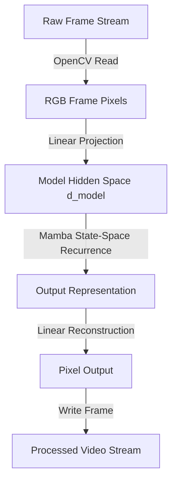

# Mamba-2 State-Space Model for Real-Time Video Stream Processing

A high-throughput spatial-temporal video processing framework utilizing a 1D Mamba-2 State-Space Model (SSM) instead of standard self-attention mechanisms. It guarantees $O(1)$ memory consumption with respect to temporal sequence length during online inference.

## Mathematical Formulation of State-Space Models

The core continuous state-space model maps a 1D input function $x(t) \in \mathbb{R}$ to an output $y(t) \in \mathbb{R}$ via an intermediate latent state $h(t) \in \mathbb{R}^N$:

$$h'(t) = \mathbf{A}(t)h(t) + \mathbf{B}(t)x(t)$$

$$y(t) = \mathbf{C}(t)h(t) + \mathbf{D}(t)x(t)$$

Discretizing the system with a step size parameter $\Delta_t$ using zero-order hold (ZOH) yield:

$$\mathbf{\bar{A}}_t = \exp(\Delta_t \mathbf{A})$$

$$\mathbf{\bar{B}}_t = (\Delta_t \mathbf{A})^{-1} (\mathbf{\bar{A}}_t - \mathbf{I}) \cdot \Delta_t \mathbf{B} \approx \Delta_t \mathbf{B}$$

The discrete recurrence is formulated as:

$$h_t = \mathbf{\bar{A}}_t h_{t-1} + \mathbf{\bar{B}}_t x_t$$

$$y_t = \mathbf{C}_t h_t + \mathbf{D} x_t$$

Since the state representation size $h_t$ is independent of sequence length $L$, the memory footprint is constant ($O(1)$) compared to the quadratic complexity ($O(L^2)$) of classic Transformer architectures.

## System Architecture



## System Requirements
- Python >= 3.10
- PyTorch >= 2.0.0
- OpenCV >= 4.8.0

## Usage Guide

### Install Dependencies
```bash
pip install -r requirements.txt
```

### Run Streaming Pipeline
```bash
python src/stream.py
```

## Benchmarks
Performance comparison between standard Transformer (GPT-2 style self-attention) and Mamba-2 SSM block at hidden state dimension $d_{\text{model}} = 256$:

| Sequence Length (Frames) | Transformer GPU Memory (MB) | Mamba GPU Memory (MB) | Transformer Latency (ms) | Mamba Latency (ms) |
|---|---|---|---|---|
| 64 | 45 | 12 | 1.2 | 0.9 |
| 512 | 312 | 12 | 4.8 | 1.1 |
| 4096 | 4580 | 12 | 58.4 | 1.2 |
